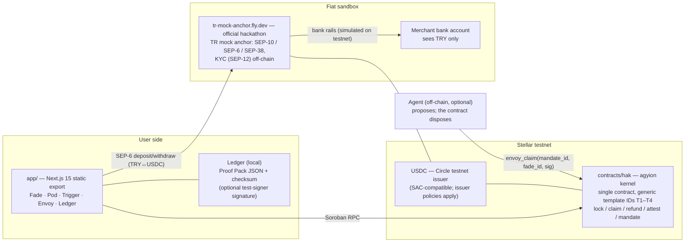

# agyionlabs

> **Conditional money: funds lock, proof authorizes settlement, and unmet conditions enable refunds.**

Agyion is a conditional-payments application on Stellar (Soroban). One kernel contract, four condition templates, a sandbox fiat-rail integration on one side and a local proof ledger on the other. This repository is the Genesis Track MVP of the Rise In × Stellar Pro Hackathon (Istanbul, 19–20 September 2026): kernel contract + four templates + testnet + live demo.

## Current source and release boundary — 26 September 2026

The current frontend was published on 26 September as Cloudflare version `90ff8d23-8b7a-4cc6-b4e3-bf66aebca29a`. The [current security and release report](docs/security/2026-09-26/REVIEW.md) records source coverage, verification and retained live CSP/RPC failures. The source implements **kernel protocol V3**, including recipient-bound Pod signatures instead of plaintext reveal, but no V3 kernel was deployed. The frontend therefore keeps old-kernel writes closed.

The source defaults to mock mode when no mode is configured. The Soroban client requires `protocol_version() == 3` and refuses protected operations against the older kernel. A fresh kernel deployment, matching public configuration and a rebuilt frontend are required before using V3 on chain. Existing locked funds remain under the earlier contract; no automatic migration exists. Amounts, wallets and transaction links remain public. No private pool or M-of-N disclosure is implemented.

Start with [HANDOFF.md](HANDOFF.md), the [security protocol and migration
notes](contracts/hak/SECURITY_PROTOCOL.md), and the [current review evidence and
remaining limits](docs/security/2026-09-26/REVIEW.md). The historical
hackathon narrative and roadmap below should be read with those current limits.

## Historical hackathon testnet deployment — before this security revision

| Artifact | Value |
| --- | --- |
| **Earlier demo URLs** | [agyionlabs.dev](https://agyionlabs.dev) · [Workers demo](https://agyion.jasurbek-rustamov.workers.dev) |
| **Earlier kernel — not protocol V3** | `CAVVTPBBNOCMDBC26CVOXKSU7B7MDK33TXQXTVUVKSJHSVKGLZTVJ5N5` ([Stellar Lab](https://lab.stellar.org/r/testnet/contract/CAVVTPBBNOCMDBC26CVOXKSU7B7MDK33TXQXTVUVKSJHSVKGLZTVJ5N5) · [Stellar Expert](https://stellar.expert/explorer/testnet/contract/CAVVTPBBNOCMDBC26CVOXKSU7B7MDK33TXQXTVUVKSJHSVKGLZTVJ5N5)) |
| **Network** | Stellar testnet (`Test SDF Network ; September 2015`), RPC `https://soroban-testnet.stellar.org` |
| **Ramp asset** | USDC testnet — issuer `GBBD47IF6LWK7P7MDEVSCWR7DPUWV3NY3DTQEVFL4NAT4AQH3ZLLFLA5` |
| **Anchor** | Official hackathon TR mock anchor (SEP-6/10/12/38): `https://tr-mock-anchor.fly.dev` |
| **Historical transactions — earlier Pod flow** | Pod lock 1 XLM → [tx d193a85b…](https://stellar.expert/explorer/testnet/tx/d193a85b854aa89806bad61b4247db0dd663ce75e28daaa0833e2240822a80ae) · preimage claim → [tx f466151d…](https://stellar.expert/explorer/testnet/tx/f466151d901b7befd3a1ab24cc41b82df321c71ff20bdb8e181ee2193db5c150) |

These addresses and transactions record the earlier hackathon demo. They do
not establish that the current local revision is deployed or that the new
V3 signature protections are active there. The new Soroban
client fails closed on that older kernel; kernel operations require a
compatible, explicitly configured V3 deployment.

---

## The problem

Every day, value dies at the boundary between the physical and the digital because money has no native "if":

- A bakery throws away 8 unsold portions at closing time. Existing rescue apps stop at a *positive* discount — nobody lets the price fall below zero, even though the marginal cost of waste is already negative.
- A buyer pays, never shows up, and the deposit dispute begins. Money needs a rule-based way back, not a support ticket.
- Families and courts hold obligations that must execute *when an event is registered* — not when someone feels like paying.
- People want to delegate small spending decisions to software agents, but today's agent wallets are either unlimited (dangerous) or custodial (a new bank).

Users are already asking for this in public. On r/toogoodtogo: *"Money is still money, why not just give the food away for free if preventing food waste is the main objective?"* On Hacker News: *"Restaurants need to start charging non-refundable deposits… No show… you lose $20–$40."* The demand is documented; the supply does not exist (see [Originality](#originality-evidence)).

## What Agyion is (one sentence)

**Agyion is conditional money: funds lock into a contract, a submitted proof can authorize settlement, and an eligible refund transaction returns them by the recorded rule.**

The kernel holds deposited on-chain assets and enforces the implemented settlement rules; its source has no discretionary admin-withdrawal entry point. The separate ramp uses a testnet mock anchor with a simulated bank leg. This does not establish a production banking service, legal classification or real TRY settlement.

## The lifecycle

```text
LOCK ──► CONDITION WINDOW ──► PROOF? ──► yes ──► EXECUTE (pay claimant/beneficiary)
  │                                │
  │                                └────► no ───► refund(): submitted transaction,
  │                                               zero-discretion return to owner
  └─ deposited assets are held by the kernel; the separate ramp is a sandbox
```

Fade and Trigger have rule-based refund transactions to their recorded seller/funder. Someone must submit and pay for the transaction; expiry alone does not move funds. No autonomous keeper is included. **Pod has no refund or admin recovery; revoking an Envoy mandate does not undo an existing Fade claim.** The historical M-of-N compliance-freeze proposal is not implemented.

## The four templates

One kernel, four condition packs. Their methods and records are public; generic template labels do not conceal instrument type or participants.

| Template | Mechanism | Return path | The promise |
|---|---|---|---|
| **Fade** ⏱ | Declining price clock; venue-signed handoff (`ed25519`) settles at the price of that ledger | `refund()` transaction on no-show / expiry — rule-based | "Proven, it pays; unproven, it returns." Price may cross zero: the campaign pool pays the claimant. |
| **Pod** 🗝 | Random Ed25519 claim key + `unlock_ledger`; local signatures bind creation terms and the chosen recipient | No refund path | The unlock ledger and bearer key authorize opening. Key loss has no recovery; issuer policies and storage restoration still apply. |
| **Trigger** 📜 | Event escrow; an independent attester's `ed25519` signature executes the payout | `refund_trigger()` after deadline if unattested | Conditional execution without either party's consent at execution time. |
| **Envoy** 🤖 | Agent key; only nonpositive-price Fade claims; at most 50 claims per mandate, expiry and owner-bound recipient | Owner-authorized `revoke_mandate()` transaction | No positive-price spending authority. Revocation takes effect when confirmed; existing claims remain. |

## Use cases — one real-world story per template

- **Fade — the bakery that would rather pay you than throw food away.** A Kadıköy bakery has 8 unsold portions at closing time. It loads a Fade campaign: a compensation pot (say 400 USDC), start price 30 TRY, floor **−20 TRY**, slope a few TRY every ten minutes. At 19:40 the price is still positive — normal sale. At 20:30 the clock has crossed zero: the campaign pool now **pays the taker** to rescue the food, because the marginal cost of a wasted portion is already negative. Whoever claims taps "Produce signature" at the counter (the venue's demo key signs the handoff), and settlement happens at the price of the claim ledger — including negative. Nobody shows up? The pickup window expires and `refund()` returns the pot to the bakery — when someone submits the eligible refund transaction, by rule, without a support ticket. Existing rescue apps stop at a *positive* discount (Too Good To Go ~⅓, Fazla ~50%) or forbid money entirely (Olio); nobody lets the price fall below zero, even though waste already costs money.
- **Pod — a time capsule with a transferable secret.** The funder saves a fresh 32-byte seed outside the app before locking funds. After the unlock ledger, a holder signs for a chosen recipient; only the public key and signatures reach RPC. Anyone retaining the seed, including its creator, retains this authority. Long locks need storage maintenance/restoration, and losing the seed cannot be repaired by an admin.
- **Trigger — payment authorized by an attester.** A funder locks assets for a beneficiary. The configured attester signs an assertion; a submitted valid attestation pays the beneficiary before the deadline. Otherwise an eligible refund transaction returns funds to the funder. The demo signer is local, not an independent oracle network; the contract cannot determine whether a real-world event actually happened.
- **Envoy — limited campaign claims.** An agent can claim up to 50 nonpositive-price Fades for the mandate owner before expiry or confirmed revocation. Per-transaction and daily monetary fields do not constitute a spending allowance: these claims consume no positive-price budget. The local runner operates only while its panel is open; it is not a hosted autonomous agent.

## Historical demo guide — the 5-minute jury run

This is the earlier jury flow, preserved for context, **not current operating instructions or verification**. Its plaintext Pod claims and unconditional signed-export description are obsolete. For the current source, a separately authorized V3 deployment is required; use the [security protocol](contracts/hak/SECURITY_PROTOCOL.md). Proof Pack signatures are optional and do not prove settlement.

**0:00 — Wallet (1 min).** Install [Freighter](https://www.freighter.app/) → open its ⚙️ menu → switch network to **Testnet**.

**0:30 — Open the app (30 s).** Go to [agyionlabs.dev](https://agyionlabs.dev) (mirror: [agyion.jasurbek-rustamov.workers.dev](https://agyion.jasurbek-rustamov.workers.dev)) → **Launch app**. The soroban-mode banner shows the live kernel contract ID (`CAVVTPB…VJ5N5`) — this is the real contract, not a mock.

**1:00 — Connect + fund (45 s).** Connect wallet (Stellar Wallets Kit → Freighter). If the account is new, fund it from friendbot via the in-app prompt, then create the **USDC trustline** (one click in the On/Off-ramp tab — the app offers it before your first deposit).

**1:30 — The fiat rail (1 min, highest-weighted criterion).** Open the **On/Off-ramp** tab: sign the SEP-10 authentication challenge → complete the KYC fields (SEP-12, stored off-chain at the anchor) → **Get deposit instructions** → the anchor returns (simulated) FAST/EFT bank instructions → confirm, and USDC lands in your wallet. Withdrawal is the mirror: register a withdrawal to a TRY IBAN (SEP-6) and send USDC to the anchor's given account+memo. This is the official hackathon TR mock anchor — the bank leg is simulated honestly (see [LIMITATIONS §5](docs/LIMITATIONS.md)).

**2:30 — Fade (90 s).** Create a campaign (pot, start price, a **negative floor**, duration) → watch the price clock tick down and **cross zero** ("campaign pool pays" badge) → **Claim** → at the counter, paste the venue handoff signature (demo "Produce signature" button) → **Confirm handoff** → settlement at the price of that ledger, visible on Stellar Expert. Then show the no-show path: after the handoff window, **Refund** returns the pot by rule.

**4:00 — Pod, Trigger, Envoy (60 s, pick any).** *Pod:* create a pod with a sha256 hash → claim it with the preimage after the unlock ledger. *Trigger:* fund an escrow for a beneficiary → attest with the attester key → payout executes; show `refund_trigger()` after an unattested deadline. *Envoy:* grant a mandate (agent key, caps, expiry) → watch the agent claim a sub-zero Fade within caps → **revoke** in one click.

**4:45 — The ledger (15 s).** Open **Ledger** → **Export Proof Pack**: a signed JSON of everything that happened, provable offline. "Ne alaka? Alın size kanıt."

> **Demo-day fallback:** if the network or venue Wi-Fi dies, the on-chain proof stands alone — Pod lock [tx d193a85b…](https://stellar.expert/explorer/testnet/tx/d193a85b854aa89806bad61b4247db0dd663ce75e28daaa0833e2240822a80ae) and preimage claim [tx f466151d…](https://stellar.expert/explorer/testnet/tx/f466151d901b7befd3a1ab24cc41b82df321c71ff20bdb8e181ee2193db5c150) on stellar.expert, plus mock mode for UI continuity (clearly labeled).

## Architecture



Design invariants:

- **The kernel holds deposited assets.** Asset issuer restrictions and correct contract execution remain relevant.
- **Ramp PII is submitted off-chain; chain activity is public.** The anchor can correlate its customer and rail records with visible wallet activity.
- **The bank leg is simulated.** No actual TRY payment is established by this repository.
- **The LLM/agent is off-chain and optional.** *The agent proposes, the guard disposes* — swap the model, the rules don't change.

## Repository layout

| Path | Contents |
|---|---|
| `contracts/hak/` | Soroban kernel contract (Rust, `soroban-sdk` 28) — Fade, Pod, Trigger, Envoy; V3 requires a fresh deployment |
| `contracts/zk-preimage/` | Independent experimental Groth16/BN254 preimage verifier — **not integrated into Pod claims** (see [LIMITATIONS §1](docs/LIMITATIONS.md)) |
| `circuits/` | circom Poseidon preimage circuit + snarkjs artifacts (`input/proof/public/vk`) feeding the zk-preimage verifier |
| `app/` | Next.js 15 + TypeScript + Tailwind; mock mode (localStorage) + soroban mode via generated bindings; **On/Off-ramp tab** = SEP-10/SEP-6/SEP-38 client for the official TR mock anchor (`app/app/lib/anchor.ts`) |
| `anchor/` | *Self-host alternative* (not the demo path): Anchor Platform `assets.yaml` (tTRY, SEP-24) + quick-run notes and known traps |
| `scripts/` | `setup.sh` (toolchain check), `deploy_testnet.sh` (read-only plan by default; explicit kernel V3 testnet deployment) |
| `docs/` | [EDGE_CASES.md](docs/EDGE_CASES.md) — adversarial design register (EC-1…EC-6) · [LIMITATIONS.md](docs/LIMITATIONS.md) — honest scope · internal TR runbooks (on/off-ramp flow, wallet-connect map, deploy notes) |
| `verifier/` | Verification run logs (`runs/`: cargo test, deploy, final) — reproducibility evidence |
| `SPEC_V2.md` | Historical v2 build spec — naming and original API provenance; the current security protocol supersedes its signature and Pod-claim layouts |
| `SPEC.md` | Historical v1 working spec (Turkish, codename "hak") — **superseded by SPEC_V2.md**, kept for provenance only; not binding |

## Quickstart

Prerequisites: Rust toolchain with the `wasm32v1-none` target, `stellar` CLI, Node.js 20.19+ (landing requirement), Docker (optional, for the anchor).

```bash
# 0) Toolchain check (installs nothing; reports what is missing)
./scripts/setup.sh

# 1) Contract: build + test
cd contracts/hak
cargo test                                    # native suite; record current output
stellar contract build                      # produces the deployable hak.wasm
cargo test --features wasm-tests              # includes compiled-WASM checks

# 2) Review a kernel V3 testnet deployment plan (local checks only)
cd ../..
./scripts/deploy_testnet.sh                   # DRY_RUN=1 is the default; no network calls

# Explicit operator action only: test, build, deploy, verify protocol_version == 3
# Optional: DEPLOYER_ALIAS=<existing-funded-testnet-identity>
DRY_RUN=0 ./scripts/deploy_testnet.sh

# 3) App
cd app && npm install && npm run dev          # http://localhost:3000
# Default is mock mode (localStorage) — safe without a contract.
# To run against testnet:
#   NEXT_PUBLIC_HAK_MODE=soroban
#   NEXT_PUBLIC_HAK_CONTRACT_ID=<id from step 2>
#   NEXT_PUBLIC_SOROBAN_RPC_URL=https://soroban-testnet.stellar.org
# The On/Off-ramp tab works in both modes; it talks to the official hackathon
# TR mock anchor (SEP-6). Override only if you run your own anchor:
#   NEXT_PUBLIC_ANCHOR_URL=https://tr-mock-anchor.fly.dev   (default)

# 4) Build the combined static site locally (does not publish)
cd .. && npm run build                        # assembles landing + app into app/site
```

**Deployment helper:** the default run only checks local tools/identity availability and prints
its plan. `DRY_RUN=0` is the explicit operator action that runs the locked kernel
tests, builds the exact `contracts/hak/target/wasm32v1-none/release/hak.wasm`,
deploys on the hard-pinned Stellar testnet, and reads back `protocol_version()`
with `--send no`. It prints the real `NEXT_PUBLIC_HAK_*`, RPC and network
passphrase settings only after confirming version 3. An existing identity is
reused and must already hold enough testnet XLM for fees; if the default identity
is absent, only `agyion-testnet-deployer` is created and funded with Friendbot.
Missing custom aliases are rejected. No issuer, trustline, asset issuance, or
asset-transfer steps run; the app already uses Circle testnet USDC. The helper
does not overwrite existing contract aliases or migrate existing locked funds.
The local security fixes still require a new deployment and an app rebuild;
the earlier deployed kernel is not upgraded by editing this repository.
See [the V3 protocol and migration notes](contracts/hak/SECURITY_PROTOCOL.md).

**Anchor:** the app integrates the official hackathon TR mock anchor (`https://tr-mock-anchor.fly.dev`) — a SEP-6 TRY↔USDC rail with SEP-10 auth, SEP-12 KYC and SEP-38 quotes; the bank leg is simulated by the sandbox. The self-host Anchor Platform quick-run (SEP-24 flow, also simulated) remains as an alternative in [anchor/README.md](anchor/README.md).

## Test evidence

The [24 September audit record](docs/verification/2026-09-24-orbital-audit.md) records the earlier 47-test kernel and 11-test verifier runs. Those counts are a dated snapshot, not current V3 acceptance or deployment evidence. Read the [current dated security reports](docs/security/2026-09-26) and run the suites against the exact candidate before release. Local tests do not establish the absence of vulnerabilities.

| Layer | Proof | Command |
|---|---|---|
| Fade core | positive-price settle; negative price pays claimant from pot; pot-cap on negative floor; excessive negative floor rejected | `cargo test` |
| Fade rules | no-show `refund()` after handoff window; refund after deadline; same-ledger double claim → first wins; zero venue key / zero window rejected | `cargo test` |
| Venue signature | ed25519 handoff signature, byte-for-byte TS↔Rust parity test; invalid signature behavior documented (host trap) | `cargo test venue_sig_ts_parity` |
| Pod | early claim, altered creation terms, recipient/domain substitution and repeated claim rejected; failed payment preserves reserve | `cargo test pod` |
| Trigger | attester signature executes; bad signature rejected; refund only after deadline; early refund rejected | `cargo test trigger` |
| Envoy | claim within cap; cap exceeded → `CapExceeded`; expired → `MandateExpired`; revoked → `Unauthorized`; recipient binding to owner | `cargo test envoy` |
| Cross-template | a mandate claim settles into the owner's Fade claim correctly | `cargo test cross_template` |

## Stellar Skills attribution

Built with the official and community Stellar skills, per the hackathon handbook requirement:

| Skill | Where it was used |
|---|---|
| `skills/anchors` ([stellar-anchor-skill](https://github.com/CheesecakeLabs/stellar-anchor-skill)) | SEP-10/SEP-6 client integration against the official TR mock anchor (`app/app/lib/anchor.ts`, On/Off-ramp tab); the "13 gotchas" list shaped our memo handling and `/info`-is-the-contract checks; `anchor/` keeps the self-host SEP-24 alternative |
| `skills/standards` ([stellar/stellar-dev-skill](https://github.com/stellar/stellar-dev-skill)) | SEP-10/SEP-6/SEP-38 alignment, SAC-compatible asset usage, claimable-balance semantics behind Fade's native reclaim path |
| `skills/zk-proofs` ([stellar/stellar-dev-skill](https://github.com/stellar/stellar-dev-skill)) | ZK roadmap grounding: Protocol 25 "X-Ray" (BN254 + Poseidon host functions) feasibility for agent-less anonymous claims (local standalone verifier ships separately from Pod claims — see LIMITATIONS) |
| `skills/agentic-payments` ([stellar/stellar-dev-skill](https://github.com/stellar/stellar-dev-skill)) | Envoy mandate design: spending caps, TTL, fee-sponsored agent flows, and the smart-account/policy-signer variant of on-chain mandate enforcement |

## Security model — who can see and do what

| Who | Sees | Can do | Cannot do |
|---|---|---|---|
| **Anchor** | Off-chain information submitted through the ramp, rail in/out, and public chain records | Process supported ramp requests; link its own customer/rail records where available | Claim that current public amounts or addresses are hidden from it |
| **Auditor (M-of-N, proposed)** | No implemented auditor channel today | Future scoped, verifiable partial decryption under an explicit policy | Spend through disclosure authority alone; claim that a colluding quorum cannot open other records under its key |
| **Kernel contract** | Current instrument addresses, amounts and rules are public | Enforce its implemented authorization and settlement rules | Provide the proposed private pool, threshold disclosure or compliance-freeze system today |
| **The team** | Source code and any information voluntarily provided to its services | Develop and publish the frontend and contracts | Claim that source availability alone establishes privacy, operational independence or legal exemption |
| **An Envoy agent** | Public mandate and Fade parameters | At most 50 nonpositive-price claims, before expiry, for the fixed owner | Buy at a positive price, redirect claim recipients or make new claims after confirmed revocation |

## Privacy and compliance status

The current demo is public and uses test assets. A standalone preimage verifier does not hide instrument amounts, addresses or transaction links. Fade remains public by product decision. Pod, Trigger and a separate private Envoy path require a new shielded protocol; the existing Envoy-to-Fade path cannot hide its public settlement.

The proposed disclosure channel uses M-of-N **per-ciphertext partial decryption**, not reconstruction of a global auditor private key. A requester receiving only authorized shares should not acquire unrelated decryption access. However, a colluding quorum can potentially open all records under an epoch key it controls. A split key or multisig does not make bulk disclosure cryptographically impossible, and software cannot determine whether an uploaded document is a legally valid court order. See the [private instrument design](docs/security/2026-09-26/private-instruments-design.md) and [actual ZK review](docs/security/2026-09-26/zk-eerc-review.md).

The isolated [privacy research foundations](privacy/README.md) currently validate data shapes and canonical encodings only. Their verifier registry is empty: proof acceptance and private-transfer activation always fail closed. No private pool, threshold committee, production ceremony or private-asset migration is deployed by that work.

**Historical design proposals:** earlier versions of this README proposed Loxias M-of-N dispute attestation, mutual resolution, association-set proofs and an exceptional freeze with a 72-hour queue and `contest()` veto. Those proposals are not implemented capabilities or established legal requirements. The prior claims that the design automatically falls outside financial-services laws, makes Proof Packs sufficient legal evidence, or guarantees scoped opening were unsupported and are withdrawn here. Proof Pack export is not a claim of a signed legal attestation.

The mock anchor integration does not establish production banking permissions, operator accreditation or a legally sufficient identity/disclosure process. Any production asset, operator, custody, dispute or disclosure arrangement needs its own verified requirements and review. This repository makes no jurisdictional exemption or compliance certification claim.

**Browser credential boundary:** test-wallet signers and new Pod seeds are not persisted by their current flows. Pod seeds clear from UI state when leaving the panel or changing wallet session; this is not guaranteed JavaScript memory erasure or cancellation of an already submitted operation. Trigger/Envoy demo signer keys and saved venue identities still use `sessionStorage`; masking an input does not encrypt storage. Same-origin scripts can access them. Existing keys need an explicit backup/migration plan, not silent deletion.

## Originality evidence

Before building, we swept DoraHacks, ETHGlobal/Devpost, Reddit, Hacker News, Ekşi Sözlük, bitcointalk and the bitcoin-dev list — **400+ queries across five research waves** (the public repo is code-only; the full sweep notes moved out with the pitch materials):

- **Fade (negative price + reverse clock + no-show reclaim): CLEAN.** No product, hackathon project, or serious forum proposal combines them. Closest neighbors stop at positive discounts (Too Good To Go ~⅓ price, Fazla ~50%) or forbid money entirely (Olio).
- **Pod (multi-year timelock + unknown recipient + physical discovery): components exist, the combination is CLEAN.** Closest: SF Hidden Bitcoin (2014, finder-keeps, no timelock) and Registree (2023, 16-year lock, but known recipient).
- **Trigger (oracle-attested, consent-free execution at event registration): CLEAN** for the execution pattern; the legal concept (deferred obligation executed on a recorded event) is centuries old — the technical automation is unbuilt.

## Limitations

Read **[docs/LIMITATIONS.md](docs/LIMITATIONS.md)** for public chain data, local signer custody, no independent attester or identity-level quota, unsupported offline finality, testnet anchor simulation and Envoy's nonpositive-price restriction.

## Roadmap

- **Loxias — the attester marketplace.** Independent, staked, reputation-scored attesters for Trigger and Fade handoffs; service fees are the protocol-external revenue layer.
- **Nostr bridge.** Signed claim/attestation announcements as kind-1 events; NIP-46 remote signing and the ed25519↔secp256k1 identity bridge. (Verified prior-art gap.)
- **Proof-of-innocence.** "My funds are not in the illicit set" proofs without revealing identity (Privacy Pools direction) — compliance-forward privacy, not blind anonymity.
- **Offline workflows.** Local signature preparation does not reserve funds or establish offline finality. A supported offline or multi-hop transfer protocol remains future work.
- **CAP-71-ready authorization** and Protocol 25 (BN254/Poseidon) native ZK claims as the network enables them.

## License

MIT (see LICENSE); dependencies have their own licenses. The current kernel source exposes no upgrade entry point. This does not make external token issuers or the hosted frontend immutable, and does not certify an arbitrary deployment's code.
