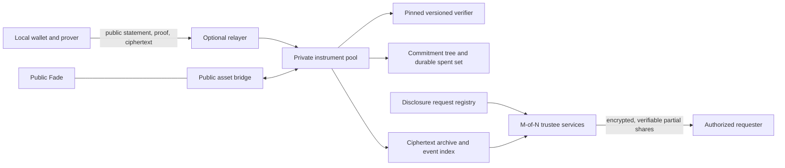

# Private Pod, Trigger and Envoy — design for review

Date: 2026-09-26. Source checkpoint: `29db661`. Status: **proposed protocol, not implemented or deployed**. This document follows the user's requirement that Fade remain public, while Pod, Trigger and Envoy pursue private amounts and counterparties with authorized M-of-N disclosure. It does not establish legal compliance or production security. See [the actual circuit/verifier review](zk-eerc-review.md) for present behavior.

## 1. Decision and actual starting point

Use a **new shielded note pool**, shared by the three private instruments. Keep funds inside that pool through their private lifecycle. Store commitments, nullifiers and encrypted records; prove authorization, conditions and conservation without publishing their private values. Do not try to turn the current public-address HAK records into anonymous records by adding a preimage proof or masking the interface.

Fade stays on the existing public path. The existing Envoy adapter that claims Fade also stays public: it calls `claim_internal(..., mandate.owner)`, and its grant, claimant and Fade settlement are public. A separate private Envoy capability can operate inside the new pool. It cannot make a subsequent public Fade interaction anonymous. This is an explicit product boundary, not a reason to make Fade private or silently expand an agent's permissions.

### Existing repository commitments found

| Location | Existing statement | Treatment in this design |
|---|---|---|
| `docs/EDGE_CASES.md`, EC-1 | Fade's physical redemption is outside an anonymity promise | Preserve; Fade is public |
| `docs/EDGE_CASES.md`, EC-2; `docs/LIMITATIONS.md:9` | Loxias M-of-N attesters and mutual resolution are roadmap | Distinct from the disclosure committee; not implemented |
| `docs/EDGE_CASES.md`, EC-6; `README.md:244–271` | Shamir-split auditor key, court-attested assembly, supposedly one transaction only | Replace the architecture with verifiable partial decryption; key reconstruction does not provide that scope guarantee |
| `docs/EDGE_CASES.md:21` | ZK alone makes an A-to-B Pod transfer anonymous | Unsupported for the current code; a shielded state model is needed |
| `docs/LIMITATIONS.md:23–28` | Current ZK is separate and claims are traceable | Matches current code |
| `contracts/hak/src/{pod,trigger,envoy}.rs` | Public addresses/amounts, authenticated public funding, plaintext Pod reveal, single Trigger signature | Existing V1; not migrated by this document |

Repository-wide text searches found no implemented threshold DKG, trustee shares, partial-decryption proof, threshold auditor registry or disclosure request processor. This is a source-search conclusion, not an assertion about an external committee. The older legal comparisons, automatic "court order" enforcement and freeze promises are not carried forward as facts.

## 2. The privacy promise and its limits

| Observer / surface | Proposed visible information | Proposed hidden information |
|---|---|---|
| Public internal transaction | Pool/version, time, root, nullifiers, output commitments, fixed-size ciphertexts, proof, fee/relayer, key epoch | Note amount/asset, participant pool keys, condition values, input-to-output correspondence; instrument type only if the common-circuit performance gate passes |
| Public deposit / withdrawal | Base asset, amount, source/destination address, time and aggregate reserve movement | Subsequent internal transfers, subject to the effective anonymity set |
| Sender / recipient | Their own transaction and counterpart information shared with them | Unrelated users' records; no global viewing key |
| Relayer / RPC / indexer | Public statement and ciphertext, plus transport metadata visible to that service | Secret, note opening, spending key, proof witness |
| Fewer than M disclosure trustees | Ciphertext, request metadata, their own key share | Protected facts under that epoch, assuming the chosen threshold construction is secure |
| Authorized requester with M valid shares | Only requested field envelopes in that request | Unrequested fields for which no shares were provided |
| Colluding M trustees | Potentially **every** ciphertext encrypted to a key epoch they control | No claim of protection from that quorum |

Public anonymity is a target for internal transfers, not absolute anonymity from traffic analysis, counterparties, compromised devices or a colluding disclosure quorum. An isolated deposit followed by a matching withdrawal, a tiny pool, a unique deadline, fees, asset-specific calls, public address registries, browser telemetry and reused relay accounts can identify users despite a valid ZK proof.

Use one multi-asset commitment tree and common internal transaction shape to avoid unnecessarily partitioning users. A transaction handles one asset at a time; swaps are out of scope. The asset identifier is a private witness internally, with allowlist membership proved against a public asset-policy root. Public ingress/egress necessarily identifies the asset. Fees and distinct circuit/endpoint choices must be included in leakage measurements.

Use fresh pool receiving addresses exchanged privately, not a mandatory public Stellar-address-to-pool-key registry. Separate spending, incoming-view, recovery and disclosure keys. Do not derive spending secrets from a wallet signature that is published, logged or reusable by another origin. Use an independently generated secret and an explicitly designed encrypted backup. Relaying can remove a public user's fee-paying address; it does not itself conceal the network source from the relayer.

## 3. Proposed components and state

`PrivatePoolV2` owns reserves and enforces accepted roots, spent nullifiers, active verifier/version, asset rules, current revocation/policy roots and ledger freshness. The verifier is selected from a pinned registry; callers cannot substitute one. Private transfers never call a public asset transfer for each private recipient. Deposit/withdraw adapters alone cross the public asset boundary.

`DisclosureEpochRegistry` records the public committee key, public verification shares, participant identities, M/N, suite/version, DKG transcript hash and activation/retirement policy. It carries no spending power. `DisclosureRequestRegistry` records scoped authorization and receipts, not decrypted personal data. Administrative control over these registries is separate from token spending and Trigger outcomes.

`CiphertextArchive` must support recovery from genesis/checkpoints, not depend on a short RPC event window. Initial testnet work must retain complete encrypted records and commitment insertion proofs in a reproducible archive. A production choice between on-chain bytes and independently replicated, content-addressed storage needs a measured storage/cost/availability design. A ciphertext hash alone is not a recoverable note. Do not accept value-bearing deposits before durable availability and recovery are demonstrated.

### Note and transaction representation

An encoded note commits to:

`version, poolDomain, assetId, value, spendPolicy, recipientViewKey, condition, disclosurePolicy, nullifierSeed, blinding`.

All encodings must specify byte order, length, range and domain labels. Addresses/network IDs use canonical byte limbs or a specified collision-resistant digest; never silently reduce an arbitrary identifier modulo a field. `value` is a nonnegative base-unit integer. Initial design limit: 64 bits per note, with checked wider sums and explicit conversion into SEP-41 i128 values. Larger amounts need multiple notes or a separately reviewed range change, not truncation.

For a policy note, every valid spending branch derives the **same** nullifier from its committed high-entropy nullifier seed and the pool domain. Do not derive one nullifier from the beneficiary key and another from the refund key: that would allow both branches to spend one escrow. Knowledge of this seed alone must not authorize spending. Spending keys and raw nullifier seeds are excluded from audit disclosure envelopes.

A public transition statement contains: domain/version, an accepted input root, input nullifiers, output commitments, ciphertext digest, ledger validity interval, current policy/revocation roots, disclosure epoch, public ingress/egress values when applicable, and bound fee/relayer parameters. The digest is computed from canonical, length-bounded bytes that the contract actually receives or references under the chosen availability rule.

The prototype shape is two input value notes and two output value notes, padded with explicitly constrained dummy notes; capability state uses a separately counted fixed slot. Dummies have zero value and cannot bypass authorization or inject arbitrary nullifiers. The final common shape must be measured before promising hidden instrument type. Separate verifier IDs would reveal that type, even if parties and amounts remain hidden.

### Common proof obligations

1. Every real input is a member of the accepted commitment tree and opens to exactly its encoded note. Input nullifiers are distinct and computed from that note; the contract rejects any already spent nullifier.
2. The prover holds the key/credential required by the chosen private branch. All public output, relay, fee and ciphertext fields are constrained; copying a proof cannot redirect value or change the fee recipient.
3. Every value lies in range. Per asset, `inputs + authorized public deposit = outputs + public withdrawal + fee`. Integer sums cannot wrap in the proof field. There is no circuit-controlled mint path.
4. Output policies, recipients and view keys match the allowed transition. A privately selected asset must be allowlisted and identical across each transaction's value-bearing notes.
5. The proof interval is enforced against the current ledger. For an unlock branch, `validFrom >= unlock`; for an attestation branch, `validUntil <= deadline`; for refund, `validFrom > deadline`. A proof that sat in a queue cannot cross branches by using an old timestamp.
6. Recipient ciphertext and each audit field envelope encrypt the exact committed/output facts under the required keys. This includes encryption randomness, point validity, key epoch, message encoding and authenticated context. See §5.
7. Validation, input consumption and output insertion are atomic. A failed external asset call rolls back the entire public bridge transition. Restrict supported assets to verified semantics; do not assume arbitrary token contracts preserve reserves or transfer exactly the requested amount.

Persistent nullifiers and policy state cannot be forgotten while their proof domains remain valid. Archival/restoration must preserve spent status. A new tree epoch does not reset spend uniqueness for old notes. Root acceptance/history and data-availability recovery require bounded storage plus explicit migration, not deleting old security state to save rent.

## 4. Instrument semantics and authority

### Pod: time + secret + intended recipient

Funding converts private value into a Pod policy note containing the unlock ledger, a versioned secret commitment and the intended recipient's pool spending key. Claim proves all three conditions and produces a fresh private recipient note. The preimage stays local during proving and never enters RPC simulation, calldata, events, analytics or exported logs. Fixed recipient is the default for V2; bearer reassignability would require a separate, explicit authority rule.

The sender must deliver the encrypted note opening and secret through the agreed recipient channel. Revealing the secret alone cannot pay another key. A proof copied after simulation has the same nullifier and bound outputs, so it cannot redirect the claim; first valid inclusion consumes the same note. Sender knowledge of a note they created may let them recognize its use. This is not a promise to hide a transfer from its own counterparty.

No expiry/refund is silently invented for Pod. If a future version includes recovery, the recovery branch, beneficiary and deadline must be committed at creation and use the same nullifier as claim.

### Trigger: private escrow with explicit resolution rules

Funding commits the beneficiary, refund destination, amount, deadline, evidence/terms commitment and attester policy. A valid outcome credential before the deadline pays only the committed beneficiary. After the deadline the refund branch pays only the committed funder. Both consume the same policy-note nullifier.

For M-of-N attestation, the circuit must prove M **distinct** approved members/signatures for the same domain, terms commitment, decision, destination commitment and validity period. Repeated signatures from one key cannot count twice. A circuit-friendly new attestation suite requires new keys and explicit policy versioning; it must not pretend to verify existing Ed25519 signatures through a different scheme. Signature gadget cost and audit coverage are a prototype gate. A native public verification alternative exposes its attestation transcript and must be labeled accordingly.

Truth of a delivery or dispute is outside a SNARK. The proof establishes that the configured decision authority approved a bound outcome; it cannot establish that a photograph or shipping event is truthful. The attester quorum and disclosure quorum are separate permissions. Decrypting evidence cannot move funds. If an adjudicated-dispute branch or mutual-consent shortcut is offered, its powers and deadlines must be included in the creation policy. It is not an administrator override added after funding.

### Envoy: private capability, with an explicit public Fade boundary

The owner creates a capability note: owner authorization, agent key, allowed action set, recipient policy, asset restrictions, per-action cap, remaining budget/count, time window, expiry and a committed revocation tag. A private action atomically consumes the current capability note and emits exactly one successor with correctly reduced limits. The owner receives an encrypted copy of every successor. Two concurrent actions cannot fork a counter because they consume the same capability nullifier.

Agent authority is limited to that capability and any explicitly escrowed private funds; it never includes the owner's wallet seed, broad signing rights or arbitrary output destinations. Initial capabilities preserve the present scope of nonpositive Fade claims when using the public adapter. Positive private spending requires a new, separately approved grant; it is not enabled by copying V1's effectively unused monetary-cap fields.

For private-pool capabilities, publish revoked tags into a current revocation tree and prove non-membership without exposing the tag on each use. The contract accepts only the current revocation root, not any historical root that predates revocation. Revocation requires a bound owner proof; the agent does not get the owner's revocation secret. Root changes may require rebuilding a pending proof. In a same-ledger race, the first included valid operation wins; a user interface cannot promise to undo an already included spend.

The current browser runner remains a local convenience with explicit visible activity and pause-on-hidden-panel behavior. A relayer or keeper is a separate service with no enlarged mandate. Neither UI state nor a keeper's promise replaces circuit/contract limits.

## 5. M-of-N disclosure that does not reconstruct a master key

### Capability boundary

eERC's reviewed `AuditorManager` stores one auditor address/key and allows owner-driven rotation. Its current encryption circuit uses that public key. It does not implement trustee DKG, M/N verification shares or per-request threshold decryption. Putting a multisig in front of that configuration does not thresholdize decryption. Shamir shares assembled into one persistent private key also restore unilateral access once assembled. [Pinned eERC manager](https://github.com/ava-labs/EncryptedERC/blob/8dc98cd4d63ad3aa6d86b70b8f4bbcd70f1e8be1/contracts/auditor/AuditorManager.sol)

Use a reviewed threshold encryption construction: dealerless DKG creates secret shares `x_i` and public verification shares `Y_i`, with aggregate public key `Y`. Each trustee keeps its share independently. No operator generates or stores the complete private key. DKG must cover authenticated channels, verifiable sharing, complaint/disqualification, a fixed roster, transcript agreement, identity-point rejection and unavailable/malicious participants.

For a threshold DH/ElGamal-family encapsulation `U = rG`, a trustee computes `D_i = x_i U` and proves equal discrete logarithms between `(G, Y_i)` and `(U, D_i)`. After verifying M distinct shares, the requester combines `D = Σ λ_i D_i`; this obtains the per-ciphertext shared secret, **not** the master scalar. The proof transcript binds suite, epoch, trustee identity, ciphertext digest and request ID. A threshold signature scheme such as FROST does not by itself implement this decryption protocol.

This describes the protocol relation, not a license to implement bespoke unaudited curve arithmetic or DKG. Shares, proofs and all externally supplied points require canonical encoding and subgroup checks. Reject wrong epoch, repeated trustee indices, malformed shares and altered context before combining.

### Concrete encryption prototype and its gate

For the first interoperability/cost prototype, use a prime-order **P-256 DHKEM + HKDF-SHA256 + AES-256-GCM** profile with exact RFC 9180 serialization, including its uncompressed SEC1 P-256 public-key encoding. Standard recipient encryption follows the HPKE base-mode algorithms. Threshold trustees replace only the private scalar multiplication needed for decapsulation with verified partial shares; the rest of the KEM/KDF/AEAD transcript remains exact. This threshold extension is **not itself standardized or audited by RFC 9180**. The exact encoding/profile must be frozen before vectors are generated. [HPKE specification](https://www.rfc-editor.org/rfc/rfc9180)

P-256 avoids substituting an ad hoc symmetric cipher to save constraints, but its non-native arithmetic and SHA/AES proof gadgets may be expensive inside BN254. The first prototype measures one recipient envelope plus the required audit envelopes on actual target devices and Soroban. If this does not meet budgets, stop and commission/review a circuit-friendly verifiable-encryption profile; do not drop ciphertext correctness from the proof. No production curve/suite is selected merely because it is fast in JavaScript. HPKE's standard confidentiality claim is also not a blanket recipient-key anonymity claim: the public transcript/key-privacy composition needs explicit analysis.

Separate fixed-size envelopes, with independent encapsulation randomness and keys, cover: (a) asset/amount, (b) participant pool identifiers, (c) instrument terms/outcome, and optionally (d) external identity-reference credentials. Do not put every field under one AEAD key and call releasing that key selective disclosure. Actual civil identity is available only if a legitimate external credential exists; a pool key is not a person's name. The circuit checks any required credential's signature and validity rather than trusting client-supplied identity text.

The circuit recomputes encryption from the **same witness facts** used by conservation and ownership constraints. It checks the required disclosure public key/epoch and every envelope's ciphertext/tag. Publicly hashing a ciphertext, signing a client's claim about it, or proving that the ciphertext decrypts to *some* message is insufficient: a malicious sender could otherwise encrypt a false amount or wrong recipient. The ciphertext digest is then bound to the accepted proof and stored transaction.

### Requests, delivery and accountability

An authorization object contains: request ID, exact record/ciphertext hashes, requested field slots, purpose/evidence digest, requester encryption key, authorizing policy/version, decision signatures, expiry and maximum scope. The policy determines who may authorize; software cannot determine that an uploaded document is a legally valid court order. Legal sufficiency is not asserted here.

Each trustee independently validates that object and produces only the selected ciphertext shares. Send shares and their verification proofs encrypted to the bound requester. Publishing M shares on-chain would publish the decryption ability to everyone. Public records contain receipt/transcript hashes and minimal status; sensitive case facts remain encrypted. The requester returns a verifiable disclosure receipt, and can disclose only selected facts plus their relation to the original accepted transaction.

A willing participant may separately disclose their own per-record opening/receipt without using committee powers. Never give the requester a global viewing key as a shortcut. Neither this voluntary path nor trustee shares include spending keys.

**Hard limitation:** M colluding trustees can ignore request policy and decrypt other ciphertext under their key. Per-record partial shares prevent one authorized requester from gaining a reusable epoch private key; they do not prevent a quorum from authorizing or secretly performing bulk decryption. Independent organizations, access controls, transparency logs, per-epoch keys and restricted retention reduce risk but do not remove that assumption. A claim of cryptographically impossible bulk opening would require a different, explicitly analyzed trust construction.

### Rotation, recovery and loss

- New DKG epochs apply to new ciphertext; every accepted record binds its actual epoch. Retired keys remain necessary for historical records unless those records are verifiably re-encrypted. Rotation cannot erase an old quorum's already held knowledge.
- Proactive share refresh can keep a public key while replacing shares, but only with a reviewed refresh protocol and deletion assumptions. Do not combine shares from different epochs or refresh rounds.
- Changing trustees/M/N requires a documented resharing or new-key procedure; a registry edit cannot transform old ciphertext. Test malicious complaints, incomplete resharing and threshold unavailability before enabling deposits.
- A key-compromise response stops new encryption to the affected epoch and notifies users. Re-encrypting records later cannot retract plaintext/ciphertext an attacker already copied.
- Threshold audit-key recovery never grants spending recovery. User backup/view-key recovery has a separate policy. If too many audit shares are irretrievably lost, historical disclosure may become impossible; a hidden escrow copy of the full key would invalidate the advertised threshold model.

## 6. Independently licensed components and actual audit evidence

Research snapshot checked 2026-09-26. None of these projects' audits covers the proposed Agyion composition. Pin exact releases, source hashes, transitive licenses and security advisories before implementation; a current HEAD is a research reference, not an approved dependency.

| Candidate / source | License and verified status | Proposed use / boundary |
|---|---|---|
| [Stellar Private Payments, `3def0d7`](https://github.com/NethermindEth/stellar-private-payments/tree/3def0d76c3fdc83d85ec7de7839367f743ea425f) | Mainly Apache-2.0; compiler exception GPLv3, generated-circuit distribution notices require separate license review. README says unaudited WIP. | Chain-native pool architecture and testnet compatibility reference. Do not inherit a production-ready or threshold-disclosure claim. |
| [OpenZeppelin Stellar, `a5bd8cb`](https://github.com/OpenZeppelin/stellar-contracts/tree/a5bd8cbd3d0bb8efbd5cf5e2edf9734f87e47640) | MIT. Confidential token remains a developer preview. | Useful host/token patterns; account confidentiality leaves addresses visible. Ordinary-library audits do not certify the confidential extension. |
| [gnark, `19e2174`](https://github.com/Consensys/gnark/tree/19e21741d0e71f12767adae8285080360b31ace8) | Apache-2.0. Published audit list includes separate standard-library, Groth16 Solidity and PLONK scopes. No blanket constant-time guarantee. | Independent circuit/prover and differential-vector candidate. Existing Circom tooling may remain for a licensed prototype; a browser-local prover must be demonstrated, not replaced by sending witnesses to a server. |
| [noble-curves, `e7316eb`](https://github.com/paulmillr/noble-curves/tree/e7316eb26d4d052bd6786cd954c1ed33b8484ec0) | MIT; dated module/version audit evidence. | Curve/key validation and independent client vectors. Does not supply an audited Agyion DKG or threshold encryption system; JS side-channel limits remain. |
| [DEDIS Kyber, `3194be0`](https://github.com/dedis/kyber/tree/3194be036a906ef79fa0e87d439bfd7d6e4e0afe) | Actual LICENSE is MPL-2.0-or-later, not inferred from GitHub's generic label. README requires integrators to arrange an audit. | DKG/verifiable-share protocol reference; no verified audit for the exact proposed suite/composition. Not a default production dependency. |
| [Belenios specification](https://www.belenios.org/specification.pdf) and [project status](https://www.belenios.org/) | AGPLv3 project; published threshold verification design. Project reports a DKG correction in 2.5.1 and that CSPN evaluation was unsuccessful. | Readable independent threshold-decryption reference, not a certified payment implementation or compatible circuit library. |
| [NuCypher Ferveo](https://github.com/nucypher/ferveo/tree/c75c9405ee8b972cd0a9703e7faaf0423a24e3e6) | GPLv3 repository; README marks it inactive and unaudited. | Exclude from production shortlist; documentation/reference only. |

Specific audit evidence: the [June 2024 OpenZeppelin gnark audit](https://www.openzeppelin.com/news/linea-prover-audit) identifies `e204083`, with resolutions at `065027a`, and concerns PLONK prover/verifier components. It is not a Groth16/Soroban/threshold audit. The [noble audit history](https://github.com/paulmillr/noble-curves/blob/e7316eb26d4d052bd6786cd954c1ed33b8484ec0/README.md#security) identifies v1.6.0/Cure53 September 2024 module scope and reports a v2.3.0 August 2026 review; this research did not independently re-audit either version. Use report scopes, not the word “audited” on a homepage.

The official [Stellar privacy documentation](https://developers.stellar.org/docs/build/apps/privacy) explicitly distinguishes shielded counterparty privacy from confidential tokens with visible addresses, and labels both current reference systems unaudited previews. It is a useful implementation direction, not a shortcut around independent review. No maintained, independently audited, drop-in Stellar shielded-instrument plus M-of-N-disclosure stack was established by this research.

Avalanche's [Ecosystem License 1.1](https://github.com/ava-labs/EncryptedERC/blob/8dc98cd4d63ad3aa6d86b70b8f4bbcd70f1e8be1/LICENSE.md) remains a reuse constraint. This design copies no restricted eERC circuits. General cryptographic protocol ideas and lessons from published audits are distinguished from source-code reuse.

## 7. Migration and implementation sequence

1. **Keep V1 explicit:** Fade public; existing Pod/Trigger/Envoy records public. Remediate current security findings independently. No new interface label describes old records as private.
2. **Freeze the statement/encoding spec:** note/nullifier formula, policy grammar, branch rules, ciphertext transcript, key separation, 64-bit range, integer conservation, root/TTL behavior and disclosure trust model. Review this document's choices before product cryptography is written.
3. **Build a non-value interoperability prototype:** independent host/circuit vectors, two-note conservation, both Trigger branches sharing a nullifier, one capability update, threshold DKG/share verification and proof-to-ciphertext equality. Use generated test secrets only. Measure full browser-local proving memory/time and actual Soroban invocation budgets, including storage/token calls.
4. **Select/freeze exact dependencies and proof system:** benchmark the P-256 envelope design; decide whether a reviewed circuit-native alternative is required. Select Groth16 only with a new circuit-specific ceremony and verified artifacts; compare other supported proof systems on actual costs rather than assuming the existing preimage key can be extended.
5. **Audit and rehearse operations:** independent circuit and contract audit, committee/DKG review, immutable artifact hashes, contributor transcript verification, key loss/rotation drills, archival restore, relayer outage, user backup restore, and complete encrypted-history recovery.
6. **Versioned opt-in migration:** new pool address/verifier/domain; user-authorized deposit or ordinary settlement then deposit. No admin sweep from V1. Deposits/migrations themselves remain linkable public events. Testnet first; any production funds/network action requires its own authorized release decision.

Do not create a "private" emergency withdrawal that reveals all note witnesses. A user may explicitly accept a public exit; its value/destination leakage must be clear. Upgrades cannot arbitrarily replace note spending policies. If mutable verifier governance is retained, its ability to authorize invalid spends is a real trust power, requiring explicit limits and disclosure; a multisig label alone does not remove it.

## 8. Required acceptance evidence

| Area | Minimum evidence before a privacy/value claim |
|---|---|
| Authorization / replay | Mutating network, pool, note, destination, fee, policy or ciphertext invalidates proof; copied delayed proof cannot redirect; all Trigger branches share spent state |
| Conservation | Boundary amounts, overflows, negative encodings, mixed assets, dummy abuse, unsupported tokens and simultaneous spends fail; randomized transaction sequences preserve reserves |
| Delegation | Agent cannot redirect outputs, increase limits, duplicate capability successors, exceed count/expiry, use a revoked tag against an old root or spend beyond the explicit grant |
| Threshold correctness | Every subset of M works; fewer than M do not; duplicate/wrong-context/off-curve/mixed-epoch shares fail; no master scalar is reconstructed or logged |
| Disclosure consistency | Wrong auditor key, false plaintext facts, swapped field boxes, bad AEAD context, omitted credential and different output key all fail the circuit; requester receives only selected share material |
| Privacy | Witnesses absent from RPC/telemetry; address/ciphertext/fee/circuit fingerprints measured; real small-anonymity-set and ingress/egress correlation limits documented |
| Lifecycle | State restoration retains nullifiers; old keys/records remain attributable to epochs; restore from backup plus complete ciphertext archive succeeds without short-lived RPC history |
| Setup / release | Reproducible R1CS/prover/verifier, independently verified ceremony, pinned VKs, exact audit commits, dependency/license manifest, final native and WASM budgets |

**Current result:** an implementable protocol direction and explicit research gates, not a deployed anonymous asset, completed ceremony, threshold committee or production-security claim. The two most expensive unresolved engineering items are proof-to-encryption consistency under a reviewed suite and one common private transition circuit with acceptable local proving/Soroban cost. These must be measured before scope or performance is promised.

## 9. Bounded foundations that can be implemented before a circuit exists

These are proposed independent work packages, not changes performed by this document. They must never return a synthetic successful proof, accept value or enable a production privacy label.

| Foundation | Concrete artifact and tests | Explicit limit |
|---|---|---|
| Strict statement schema | A versioned JSON schema plus canonical byte codec for domain, roots, nullifiers, commitments, ledger interval, ciphertext digest and public bridge fields. Reject unknown fields, duplicate nullifiers, malformed lengths, noncanonical field values, unsafe JS numbers and mismatched counts. Golden vectors independently decoded in TypeScript and Rust. | Schema validity is not a verified ZK statement. No modulo-reduction convenience conversions. |
| Instrument transition model | Pure, non-transactional reference state machine for Pod claim, Trigger attest/refund and Envoy capability/revocation; checked integer arithmetic and random sequence invariants. Include both Trigger branches consuming one nullifier and concurrent capability use. | A model is an executable specification, not deployed enforcement. |
| Scoped disclosure request | Strict request format with explicit record hashes/field slots, unique trustee IDs, requester key, epoch, purpose digest and expiry. Reject wildcards, duplicate slots, stale requests and cross-epoch mixing. Default to one record; larger scopes require an explicit policy. | Parsing keys/signatures does not validate DKG, curve membership or authorization. These checks remain separate required interfaces. |
| Artifact/provenance manifest | Circuit source/compiler/dependency hashes, R1CS/proving-key/VK hashes, ceremony transcript hashes, target host imports, audit commit and budget evidence, exact suite IDs. Machine-check missing/mismatched artifacts. | An existing file or hash is not proof of a sound ceremony or independent audit. |
| Public/private leakage fixtures | Recorded expected calldata/event/log shapes; tests reject private seed/preimage/note openings in RPC calls, URLs, debug output and public exports. Document public ingress/egress and Fade exceptions. | Passing fixtures does not establish network anonymity or a large anonymity set. |

Use names such as `ParsedStatement` and `UnverifiedDisclosureRequest`, not `VerifiedProof`, for data that has only passed structural validation. The future real-verifier boundary must fail closed when no supported circuit/suite is installed. Research manifests must not be enough to activate private transfers through an environment variable.

### Immediate Pod V3 safety repair — separate from privacy

The root implementer's proposed legacy replacement is a fresh 32-byte random Ed25519 bearer seed kept locally, its public claim key stored at creation, and a signature over version/network/contract/Pod ID/recipient at claim. If those encodings are fixed and the old reveal/commit fallback is removed, publishing that signature during simulation permits only the bound recipient payment. It does not reveal the seed or authorize another recipient.

Required conformance tests: altered recipient, network, deployment, version and Pod ID fail; copied signature cannot redirect; wrong/zero/malformed key and signature fail; claim executes once; no bearer seed crosses the RPC boundary; old deployment/schema is rejected by the new client. Prove or validate claim-key usability before taking funds so malformed keys do not silently create an unclaimable capsule. Keep the seed out of URLs, telemetry and public proof exports; do not substitute a short human password.

Anyone holding that bearer seed, including a funder who retained it, can authorize a destination. V3 therefore remains a public bearer authorization mechanism, not recipient-fixed anonymous money. A fresh kernel version/deployment and opt-in migration boundary are appropriate. Old funded Pods cannot acquire this safety property through an interface relabel. This paragraph records the design review; implementation/test results belong to the remediation report.
